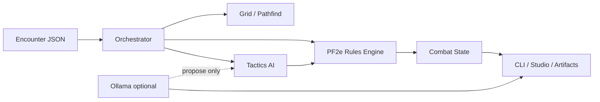

# TTRPG Combat Simulator

A Pathfinder Second Edition (PF2e) combat simulator that runs encounters from JSON fixtures, enforces rules in code, and uses an AI tactics layer to choose actions. The engine owns dice rolls, HP, positioning, and state; an optional LLM layer narrates rounds or answers questions in the companion UI.

**Current status:** V1 CLI and web companion. PF2e-inspired rules with a deterministic engine, ASCII battle maps, and replayable run artifacts.

## Quick start

**Requirements:** Node.js 20+

```bash
cd combat-simulator
npm install
npm run sim -- --encounter classic-four-vs-goblins --seed 42
```

Run a procedurally built encounter by PF2e threat budget:

```bash
npm run sim -- --threat moderate --party-size 4 --seed 42
```

Open the **Combat Studio** web UI (map editor, run history, challenge-matrix dashboard, Ollama side chat):

```bash
npm run ui
```

Optional narrative via local [Ollama](https://ollama.com/) (`llama3` by default):

```bash
npm run sim -- --encounter classic-four-vs-goblins --seed 42 --narrative --max-rounds 2
```

See [`combat-simulator/README.md`](combat-simulator/README.md) for the full CLI reference (interactive play, companion mode, rules catalog, challenge matrix, and more).

## What it does

| Layer | Role |
| --- | --- |
| **Rules engine** | Validates and resolves strikes, spells, movement, cover, concealment, reactive strikes, dying, delay, hazards, afflictions, and more |
| **Map & pathfinding** | Grid-based terrain, ASCII rendering, AoE templates, flanking |
| **AI tactics** | Scores legal actions, applies director notes, and runs a tactics agent that rejects bad picks before commit |
| **Orchestration** | Initiative, turn loop, round output, run persistence |
| **LLM (optional)** | Round narration and companion Q&A via Ollama — never the source of truth for mechanics |
| **Companion UI** | Browser studio for setup, live theater view, run history, and challenge-matrix analysis |

The LLM proposes tactics and prose; the simulator is the **rules and state authority**.

## Repository layout

```
TTRPGCombatSimulator/
├── combat-simulator/          # Runnable TypeScript package (CLI + web companion)
│   ├── src/
│   │   ├── ai/                # Tactics scoring, combat loop, archetype/feat lookup
│   │   ├── analysis/          # Challenge matrix and loop briefing reports
│   │   ├── companion/         # HTTP server, studio UI, theater, chat
│   │   ├── encounters/        # PF2e XP budget and challenge builder
│   │   ├── ingest/            # Archives of Nethys → combat data pipelines
│   │   ├── map/               # Grid, pathfinding, ASCII maps
│   │   ├── memory/            # Schemas and combat memory
│   │   ├── orch/              # Encounter loop, turns, round output
│   │   ├── play/              # Interactive PC choice prompts
│   │   └── rules/pf2e/        # PF2e rule implementations
│   ├── scripts/               # Smoke tests and batch runners
│   ├── data/                  # Ingested feats, hazards, afflictions catalogs
│   └── runs/                  # Saved simulation output (gitignored)
├── examples/                  # Encounter JSON fixtures
└── ttrpg_combat_simulator_design_docs/   # Design notes and V1 spec
```

## Encounter fixtures

Encounters are JSON files under [`examples/`](examples/). Each defines combatants (stats, weapons, spells, AI weights), map size, terrain cells, and hazards.

| Fixture | Description |
| --- | --- |
| `classic-four-vs-goblins` | Level 1 party (fighter, wizard, rogue, cleric) vs goblin patrol — default sample |
| `pcs-classic-four` | Party-only export for studio import |
| `enemies-goblin-patrol` | Enemy-only export |
| `midlevel-five-vs-ogre-band` | Higher-level encounter |
| `level5-four-vs-hobgoblin-patrol` | Level 5 variant |

Load a fixture by id:

```bash
npm run sim -- --encounter classic-four-vs-goblins --seed 42
```

Or build from the PF2e threat ladder (`trivial` / `moderate` / `hard` / `extreme`) for party sizes 3–5.

## Common workflows

### Headless simulation

```bash
npm run sim -- --encounter classic-four-vs-goblins --seed 42 --max-rounds 5
```

Runs are saved under `combat-simulator/runs/<encounter>/<timestamp>_notes/` with event logs and walkthrough markdown.

### Interactive play

PC turns use multiple-choice prompts; enemies stay on AI. Only legal actions are offered.

```bash
npm run sim -- --play --seed 42
```

### Challenge matrix (balance analysis)

Runs a grid of party sizes × threat levels × seeds and writes JSON + HTML dashboard:

```bash
npm run loop
```

Output: `combat-simulator/runs/challenge-matrix/challenge-matrix-report.html`

### Rules reference

Print PF2e action blurbs from the built-in catalog:

```bash
npm run sim -- --rules
npm run sim -- --rules Strike_melee,Step,Delay --rules-mode verbose
```

### Director notes

Boost tactic weights with natural-language hints:

```bash
npm run sim -- --notes "rogue close first" --seed 42
```

## Round output

Each round prints (in order):

1. Per-turn action log with dice breakdowns
2. Status roster for all PCs and enemies (HP, position, conditions)
3. ASCII map (letter tokens; positions only)
4. Round summary paragraph
5. With `--narrative`: Ollama prose derived from mechanical lines (no invented numbers)

Details: [`ttrpg_combat_simulator_design_docs/v1_cli_round_output.md`](ttrpg_combat_simulator_design_docs/v1_cli_round_output.md)

## Combat Studio (web UI)

`npm run ui` starts the companion server (default `http://127.0.0.1:5179/`).

| Tab | Purpose |
| --- | --- |
| **Setup** | Import party/enemy JSON, paint terrain, place tokens |
| **Combat** | Step through rounds with live map and log |
| **Loop** | View challenge-matrix results |
| **Chat** | Ask questions about the current fight (Ollama; read-only — cannot alter combat) |

CLI companion mode (attach UI to a terminal run):

```bash
npm run sim -- --companion --seed 42
npm run sim -- --play --companion --seed 42
```

## Development

```bash
cd combat-simulator
npm run typecheck    # TypeScript check
npm run build        # Compile to dist/
```

Smoke scripts exercise specific rule areas:

```bash
npx tsx scripts/smoke-archetypes.ts
npx tsx scripts/smoke-reactive-strike.ts
npx tsx scripts/smoke-held-weapon.ts
npx tsx scripts/smoke-board-terrain.ts
```

Data ingest CLIs (Archives of Nethys → local catalogs):

```bash
npm run ingest-spells
npm run ingest-feats
npm run ingest-afflictions
npm run ingest-hazards
npm run ingest-archetypes
```

## Design docs

| Document | Contents |
| --- | --- |
| [`ttrpg_combat_simulator_pf2e_design.md`](ttrpg_combat_simulator_pf2e_design.md) | Long-term vision: ruleset portability, VTT integration, replayable simulations |
| [`ttrpg_combat_simulator_design_docs/v1_cli_round_output.md`](ttrpg_combat_simulator_design_docs/v1_cli_round_output.md) | V1 terminal output contract |
| [`ttrpg_combat_simulator_design_docs/`](ttrpg_combat_simulator_design_docs/) | Additional architecture and narrative walkthrough notes |

## Architecture (high level)



## License

Private project (`package.json` marks `"private": true`). No license file is included yet.
